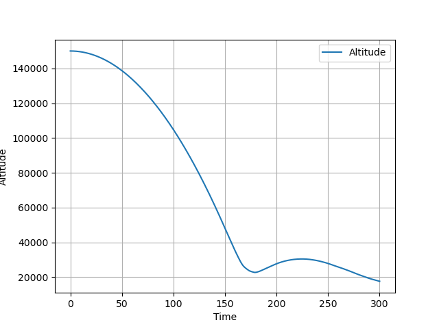
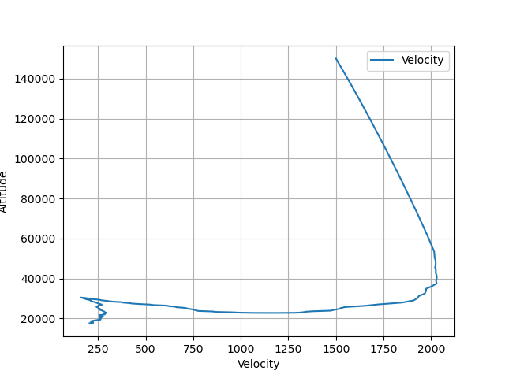
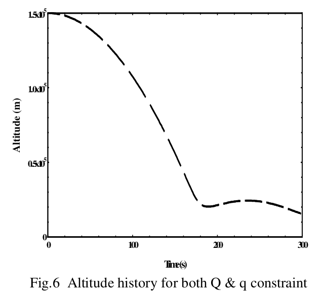
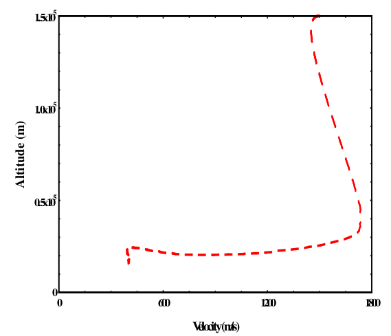
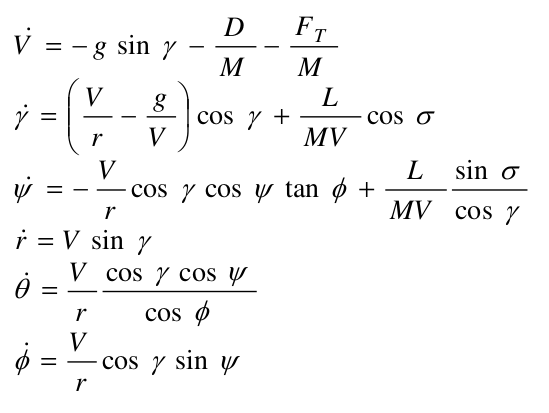
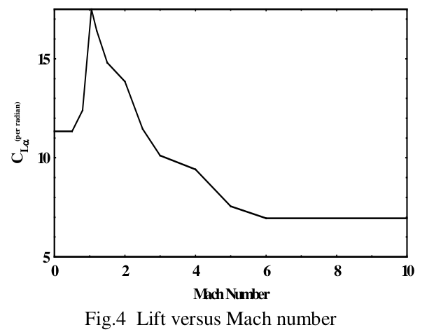
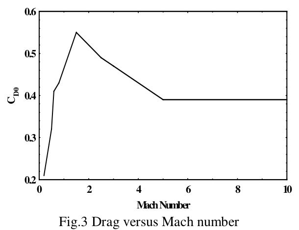

# RLV Reentry Trajectory Optimization
> This script implements the RLV re-entry trajectory problem using evolutionary approach.   

## Table of contents
* [General info](#general-info)
* [Screenshots](#screenshots)
* [Setup](#setup)
* [How to run ](#how)
* [Updates](#updates)
* [To-do list](#to-do)

## Screenshots
Output maps generated by the script.   
### Altitude Vs Time with constraints   

      

### Altitude Vs Velocity with constraints    

   

### Results compared with published paper     

   

 

## General info
Implemented RLV re-entry trajectory optimization problem as published on the paper   

Reentry Trajectory Optimization : Evolutionary Approach   
[ https://arc.aiaa.org/doi/10.2514/6.2002-5466 ]   
&nbsp;         
The main aim is to control the flight path of the vehicle throughout the reentry phase with safety bounds.     

To meet the objective, the states r, V , γ , φ , θ , ψ are considered, with their dynamics given by the following equations and with α as a control variable.    

   

where    
r is the radial distance from the center of the Earth to the vehicle,    
V is the earth relative velocity,     
Ωe is the earth angular speed,    
γ is the flight path angle,     
σ is the bank angle,    
ψ is the heading angle,     
m is the mass of the vehicle,     
g is the acceleration due to gravity,     
φ and θ are the latitude and longitude respectively.    

&nbsp;    
The guidance command is supposed to guide the vehicle through the flight corridor, dictated by the following path constraints:    
1. Heat flux constraint, q < 18.5 W/cm^2     
2. Dynamic pressure, Q < 45 kPa    
    
    
&nbsp;    
For the simulations, the initial state vector corresponding to the reentry point is assumed to be [ h0 V0 γ0 φ0 θ0 ψ0 ] = [150000,1500,0,0,0,0]    
&nbsp;    

### Aerodynamic calculations    
L and D represents the aerodynamic lift and drag forces acting on the vehicle whose expressions are given by    
L = (1/2) * ρ * V^2 * CL * Sref    
D = (1/2) * ρ * V^2 * CD * Sref   
&nbsp;    
Note that L and D are functions of the angle of attack α through the dependence 
of the drag and lift coefficients CD and CL on α.   

CL = CL0 + CLα * α     
CD = CD0 + k * CL^2    
  
Sref represents the aerodynamic reference area and CL, CD are the aerodynamic coefficients calculated by a 
two-dimensional table look up with angle of attack and mach number as the independent variables.   

   

    

&nbsp;    
### Genetic Algorithm    

Genetic algorithm is used as an optimization tool for this implementation using the library DEAP [ https://deap.readthedocs.io/en/master/ ].    
&nbsp;        
Weighted sum cost function approach is used and multiple objectives are weighted and summed together to create a composite objective function. Optimization of this composite objective results in the optimization of individual objective functions.     
&nbsp;   
### Approach 
The integration of equations of motion is carried out at 1s interval upto 300s.   

##### If your processor is slow, increase time step value mentioned in [endtime = 300; t_step = 1;] as t_step = 10    

The problem is discretized into 300 steps [t1,t2,..t300] where we have to determine control vector U[α] so as to satisfy constraints.    

The initial values of state vectors are specified. In the present study, cross range optimization is not carried out and as such σ = 0 is assumed.    
&nbsp;    

## Setup
Script is written with python (Version: 3.6) on linux. Additional modules required :   

* numpy  (tested with Version: 1.18.4 )
* matplotlib  (tested with Version: 2.1.1 )
* scipy (tested with Version:  0.19.1 )
* DEAP (tested with Version: 1.3)

## How to run   
* Verify and install required modules 
* run `python rlv_trajectory_optimizer.py`. 

## Updates   
* [06Sep2022]  
*   *  

## To-do list
* 

